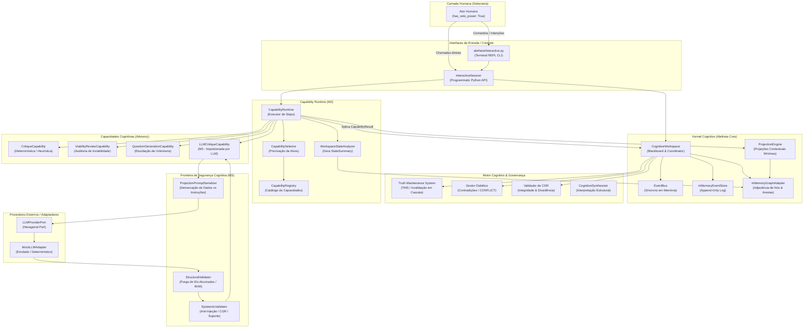

# 00 — Visão Geral do Sistema (System Overview)

## 1. O que é o Aletheia?

O **Aletheia** é um **Sistema de Cognição Colaborativa Humano-IA** construído sobre os princípios da epistemologia falseacionista (Popperiana), sistemas de manutenção da verdade (*Truth Maintenance Systems* — TMS), arquitetura de *Blackboard* orientada a eventos (*Event Sourcing*) e governança com soberania humana (*Human-in-the-Loop* com iniciativa mista).

Diferente de sistemas convencionais baseados em fluxos lineares de prompts ou agentes autônomos sem supervisão ("black-box agents"), o Aletheia implementa uma separação categórica entre:
1. **O Espaço de Estado Epistêmico e Deliberativo** (*Cognitive Workspace*): Grafo de conhecimento auditável com log imutável de mutações.
2. **Os Mecanismos de Raciocínio Probabilísticos** (LLMs e heurísticas): Atores consultivos (*Advisory*) que nunca modificam o estado global diretamente.
3. **O Árbitro Humano Soberano**: Único detentor de poder de veto, validação axiológica e iniciativa deliberativa mandatória.

---

## 2. Para Quem Foi Projetado?

O sistema foi concebido para:
* **Engenheiros e Arquitetos de Software**: Deliberação de decisões arquiteturais complexas (ex: ADRs/CDRs) com rastreamento explícito de premissas e dependências.
* **Pesquisadores e Cientistas**: Formulação de hipóteses, arbitragem de fontes contraditórias e preservação de dissidências sem consenso forçado.
* **Decisores Estratégicos e de Negócio**: Análise de modelos de produto, monetização e riscos com mapeamento de premissas vulneráveis.
* **Agentes de IA e Capacidades Cognitivas**: Execução de tarefas analíticas especializadas (ex: ceticismo metodológico, análise de viabilidade) sob isolamento contextual estrito.

---

## 3. Roadmap Evolutivo do Sistema (Milestones M0 a M10)

O Aletheia foi desenhado como um programa de desenvolvimento em 11 marcos evolutivos. O código atualmente auditado consolida os **Milestones 0 a 3**:

* **M0 ✅ Cognitive Kernel**: Fundamentos ontológicos, Event Sourcing, Truth Maintenance System (TMS) e reconstrução determinística via Event Replay.
* **M1 ✅ Interactive Workspace**: Sessão de cognição colaborativa Humano-IA com iniciativa mista, contestação de premissas, suspensão em cascata e ratificação de CDRs contextuais.
* **M2 ✅ Capability Runtime**: Isolamento adversarial por projeções contextuais mínimas, contratos declarativos de capacidades, autoridade consultiva (*Advisory*) e ciclo de orquestração do runtime.
* **M3 ← LLM Capability (ESTÁGIO ATUAL AUDITADO)**: Porta hexagonal para modelos de linguagem probabilísticos (`LLMProviderPort`), fronteira de segurança cognitiva em 2 estágios (validação estrutural de alucinações e validação epistêmica de grounding/injeção) e suíte canônica de benchmarks comparativos.
* **M4 [Planejado] Deliberation Multi-Capability**: Deliberação e debate dialético entre múltiplos especialistas concorrentes (pesquisa *CascadeDebate*), arbitragem de perspectivas divergentes e consenso fundamentado.
* **M5 [Planejado] Knowledge / RAG**: Representação de conhecimento externo, indexação semântica e integração do cofre de conhecimento (`Aletheia-Knowledge`).
* **M6 [Planejado] Memory**: Arquitetura de memória cognitiva de longo prazo (episódica, semântica e procedimental).
* **M7 [Planejado] Learning**: Ciclo de destilação de experiência empírica (`EpistemicDelta`) em lições acionáveis (`Lesson`), já scaffoldado em `aletheia.core.entities.experience`.
* **M8 [Planejado] Tools / Action**: Conexão do sistema a ferramentas externas e execução de ações no mundo real decorrentes de decisões deliberadas (`Action` $\to$ `Outcome`).
* **M9 [Planejado] Cognitive Architecture**: Unificação integral de percepção, memória, deliberação, ação e aprendizado em uma arquitetura autocoerente de iniciativa mista.
* **M10 [Planejado] Unified Intelligence**: Cognição unificada colaborativa de alto nível capaz de auto-reflexão metodológica e co-criação simbiótica com o ser humano.

---

## 4. Diagrama de Contexto do Sistema

O diagrama abaixo representa o contexto operacional real do Aletheia conforme implementado no código no estágio atual (M3):



---

## 5. Onde Estão os Dados?

* **Estado Global de Grafo**: Armazenado em dicionários Python em memória (`InMemoryGraphAdapter._nodes`, `_outgoing`, `_incoming`).
* **Histórico de Eventos**: Armazenado em lista sequencial em memória (`InMemoryEventStore._events`).
* **Persistência em Disco / Banco de Dados**: **INEXISTENTE** no momento atual (*FATO*). Qualquer reinicialização do processo Python zera o estado, dependendo do replay de eventos se os mesmos forem passados em memória.

---

## 6. Como o Sistema é Executado?

O sistema oferece dois pontos de entrada operacionais:
1. **Script de Demonstração Guiado**:
   ```bash
   .venv/bin/python demo_scenario.py
   ```
   Executa um cenário realista de 10 passos ilustrando formulação de problema, premissas, contestação humana, mudança de foco, ratificação de CDR e reconstrução determinística via Event Replay.
2. **REPL Interativo no Terminal**:
   ```bash
   .venv/bin/python aletheia/interactive.py
   ```
   Permite interagir via comandos de barra (`/problem`, `/claim`, `/fact`, `/alt`, `/link`, `/challenge`, `/step`, `/think`, `/focus`, `/interpret`, `/decide`, `/status`, `/replay`, `/exit`).
3. **Benchmark Automatizado**:
   ```bash
   .venv/bin/python benchmarks/run_benchmark.py
   ```
   Executa a suíte canônica de 10 cenários deliberativos comparando capacidades determinísticas e LLM-backed.

---

## 7. Principais Limitações Conhecidas

1. **Volatilidade de Dados**: Toda a persistência é efêmera (in-memory).
2. **Síncrono e Monothread**: Todas as operações do barramento e do runtime são bloqueantes e síncronas.
3. **Ausência de Provedores Reais de LLM**: O único adaptador de LLM funcional existente é `MockLLMAdapter`. Provedores como OpenAI, Anthropic, Google Gemini ou Ollama não possuem adaptadores implementados.
4. **Segurança de Acesso Ausente**: Os modelos de ator (`HumanActor`, `SpecialistActor`) possuem papéis e flags (`has_veto_power`), mas não há autenticação de credenciais, tokens ou verificação criptográfica de assinatura de eventos.
5. **Observabilidade Incipiente**: Não há biblioteca de logs estruturados (`logging`), métricas (`Prometheus`) ou rastreamento distribuído (`OpenTelemetry`). Diagnósticos dependem de inspeção do grafo ou saídas padrão no terminal.
