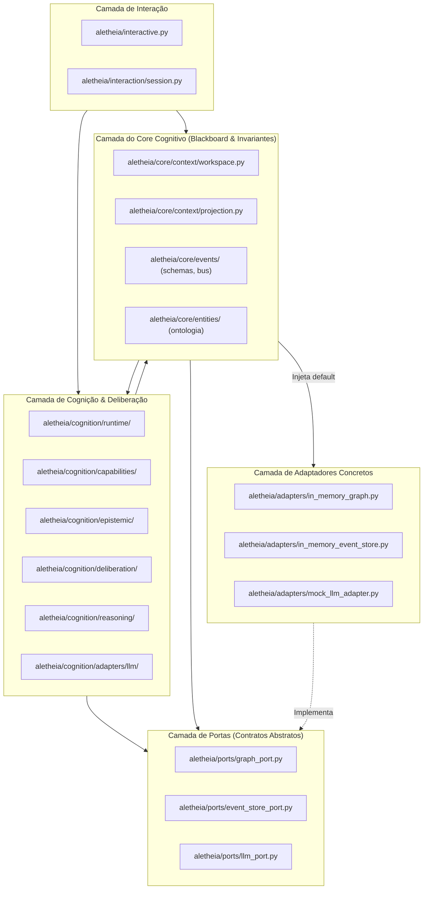
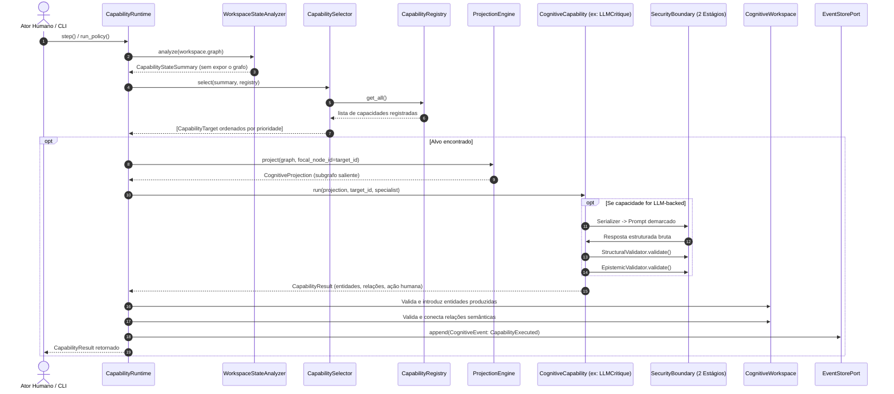
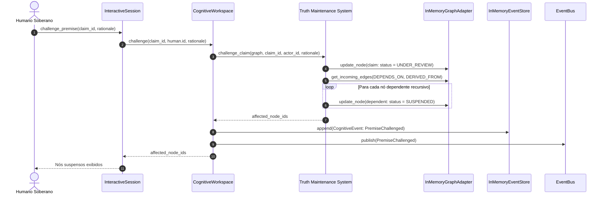

# 01 — Arquitetura Real do Sistema (Architecture)

## 1. Padrões Arquiteturais Identificados

A inspeção detalhada da base de código revela a coexistência intencional de quatro padrões arquiteturais centrais:

1. **Arquitetura Hexagonal (Ports & Adapters)**:
   * As fronteiras de infraestrutura são mediadas por portas abstratas (`GraphStoragePort`, `EventStorePort`, `LLMProviderPort` em `aletheia/ports/`).
   * A lógica de domínio e cognição em `aletheia/core/` e `aletheia/cognition/` não depende de implementações concretas de banco de dados, rede ou bibliotecas de provedores de LLM.
2. **Event-Sourced Blackboard Pattern**:
   * O `CognitiveWorkspace` atua como um *Blackboard* compartilhado onde proposições, restrições, alternativas e avaliações são afixadas e consultadas.
   * Qualquer mutação do espaço produz um `CognitiveEvent` imutável persistido em ordem sequencial estrita no `EventStorePort`.
   * O estado do grafo em memória pode ser descartado e 100% reconstruído a partir do replay de eventos (`CognitiveWorkspace.replay(events)`).
3. **Truth Maintenance System (TMS) Falsificacionista**:
   * Implementado em `aletheia/cognition/epistemic/tms.py`, rastreia grafos de dependência lógica (`DEPENDS_ON`, `DERIVED_FROM`, `SUPPORTS`).
   * Invalidação ou contestação de uma premissa propaga automaticamente estados de suspensão (`SUSPENDED` ou `UNDER_REVIEW`) em cascata para inferências e alternativas dependentes.
4. **Isolamento Cognitivo e Sandboxing Proposicional**:
   * Módulos analíticos e capacidades de IA (`CognitiveCapability`) nunca recebem o grafo completo nem o workspace diretamente.
   * Recebem exclusivamente uma `CognitiveProjection` (subgrafo mínimo e suficiente gerado pelo `ProjectionEngine` focado no alvo).
   * A autoridade das capacidades é estritamente consultiva (`CapabilityAuthority.ADVISORY`). Nenhuma capacidade escreve diretamente no grafo; elas emitem um `CapabilityResult` que é validado e aplicado pelo Kernel.

---

## 2. Diagrama de Camadas da Arquitetura

---

## 3. Invariantes Arquiteturais Fundamentais

Com base na inspeção do código-fonte e da suíte de testes, o sistema opera sob 7 invariantes rígidos:

| Invariante | Descrição | Localização no Código |
| :--- | :--- | :--- |
| **Inv-1: Separação Epistêmica** | `epistemic_type` (natureza: Fato, Suposição, Hipótese) é estritamente dissociado de `lifecycle_status` (estado deliberativo: Ativo, Sob Revisão, Suspenso, Invalidado). `SUPPORTED` jamais se confunde com `VERIFIED_FACT`. | [`aletheia/core/entities/epistemic.py`](file:///home/Aelton0/Dev/Projeto%20AGI/Aletheia/aletheia/core/entities/epistemic.py#L15-L73) |
| **Inv-2: Suspensão em Cascata** | A invalidação empírica ou contestação humana de uma premissa propaga suspensão determinística imediata para toda a cadeia dependente a jusante (`DEPENDS_ON`, `DERIVED_FROM`, `SUPPORTS`). | [`aletheia/cognition/epistemic/tms.py`](file:///home/Aelton0/Dev/Projeto%20AGI/Aletheia/aletheia/cognition/epistemic/tms.py#L10-L92) |
| **Inv-3: Contradição sem Auto-Invalidação** | A declaração de que duas proposições se contradizem (`CONTRADICTS`) marca ambas com o status `CONFLICT`, mas **não invalida arbitrariamente nenhuma das duas**. O conflito permanece aberto exigindo arbitragem empírica ou humana. | [`aletheia/cognition/epistemic/conflicts.py`](file:///home/Aelton0/Dev/Projeto%20AGI/Aletheia/aletheia/cognition/epistemic/conflicts.py#L15-L55) |
| **Inv-4: Governança de CDR & Dissidência** | Toda decisão formalizada (`CognitiveDecisionRecord`) exige escopo contextual explícito (`decision_scope >= 3 caracteres`) e obrigatoriamente preserva visões dissidentes (`DissentingView`). | [`aletheia/core/entities/decision.py`](file:///home/Aelton0/Dev/Projeto%20AGI/Aletheia/aletheia/core/entities/decision.py#L32-L65), [`aletheia/cognition/deliberation/cdr.py`](file:///home/Aelton0/Dev/Projeto%20AGI/Aletheia/aletheia/cognition/deliberation/cdr.py#L8-L48) |
| **Inv-5: Reconstrução por Replay** | O estado do grafo em qualquer momento é uma projeção pura e determinística do log imutável de eventos (`Event Sourcing`). `replay(events)` reproduz com 100% de paridade nós, arestas e status. | [`aletheia/core/context/workspace.py`](file:///home/Aelton0/Dev/Projeto%20AGI/Aletheia/aletheia/core/context/workspace.py#L226-L282) |
| **Inv-6: Autoridade Consultiva (Advisory)** | Capacidades analíticas (incluindo LLMs) têm autoridade exclusivamente consultiva. Nunca mutam o grafo diretamente; emitem `CapabilityResult` para validação e gravação pelo Kernel. | [`aletheia/cognition/capabilities/base.py`](file:///home/Aelton0/Dev/Projeto%20AGI/Aletheia/aletheia/cognition/capabilities/base.py#L18-L22), [`aletheia/cognition/runtime/runtime.py`](file:///home/Aelton0/Dev/Projeto%20AGI/Aletheia/aletheia/cognition/runtime/runtime.py#L104-L122) |
| **Inv-7: Contexto Mínimo e Suficiente** | Nenhum mecanismo cognitivo tem acesso irrestrito ao Workspace global. O `ProjectionEngine` calcula um subgrafo saliente estritamente necessário para o alvo e foco ativos. | [`aletheia/core/context/projection.py`](file:///home/Aelton0/Dev/Projeto%20AGI/Aletheia/aletheia/core/context/projection.py#L1-L132) |

---

## 4. Fluxos Críticos do Sistema

### 4.1. Fluxo de Execução do Capability Runtime

O diagrama abaixo detalha o ciclo formal executado quando o sistema avalia capacidades cognitivas:

### 4.2. Fluxo de Contestação Humana e Suspensão em Cascata

---

## 5. Análise de Acoplamento e Coesão

### Classificação do Acoplamento: **MODERADO**

* **Pontos Fortes de Desacoplamento**:
  * A camada `aletheia.core.entities` é pura, utilizando apenas Pydantic sem dependência de nenhuma outra camada do projeto.
  * Portas abstratas (`aletheia.ports`) desacoplam banco de dados, event store e LLMs.
  * O `ProjectionEngine` e o `WorkspaceStateAnalyzer` impedem que as capacidades dependam da implementação do grafo global.
* **Pontos de Acoplamento Indesejado**:
  * O `CognitiveWorkspace` instancia por default `InMemoryGraphAdapter`, `InMemoryEventStore` e `EventBus` diretamente em seu construtor (`default_factory`), acoplando o Core aos adaptadores em memória específicos (`from aletheia.adapters...`).
  * O `CognitiveWorkspace` importa funções específicas de cognição diretamente (`from aletheia.cognition.deliberation.cdr import validate_cdr_integrity`, `from aletheia.cognition.epistemic.tms import challenge_claim, invalidate_claim`), gerando acoplamento do Core com o módulo Cognition.
  * *DOCUMENTAÇÃO ≠ IMPLEMENTAÇÃO*: Conceitualmente o Core deveria ser a fundação neutra e o motor de Cognição deveria ser uma camada superior. No código atual, `aletheia.core.context.workspace` importa diretamente de `aletheia.cognition`.
