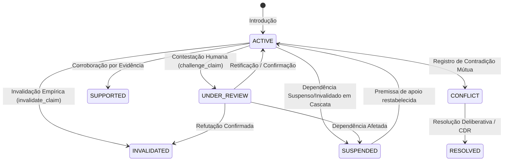

# 03 — Análise de Domínio e Taxonomia Epistêmica (Domain)

O domínio do Aletheia não é financeiro, de e-commerce ou corporativo tradicional. Seu domínio é a **Epistemologia Computacional Aplicada**, o **Raciocínio Deliberativo Humano-IA** e a **Governança de Decisões Estruturadas**.

---

## 1. Conceitos Fundamentais do Domínio

### 1.1. Princípio do Falseacionismo Popperiano
O sistema parte do axioma metodológico de que **o conhecimento humano e de IA é conjetural**. Nenhuma quantidade de evidências favoráveis pode transformar uma hipótese ou suposição em verdade dogmática incontestável.
* Uma proposição apoiada por evidências recebe o status deliberativo `SUPPORTED`.
* O status `SUPPORTED` **nunca é convertido** para o tipo epistemológico `VERIFIED_FACT`.
* Premissas e hipóteses devem explicitar condições de falseabilidade (`invalidation_conditions`).

### 1.2. Suspensão em Cascata (Truth Maintenance)
Quando uma premissa base é contestada pelo humano (`UNDER_REVIEW`) ou falsificada por evidência empírica (`INVALIDATED`), o sistema não apaga a história: ele propaga o status `SUSPENDED` para todos os nós derivados que dependiam dela. As alternativas comprometidas tornam-se inviáveis até que a premissa seja restabelecida ou substituída.

### 1.3. Conflito Dialético Não-Destrutivo
Em sistemas lógicos clássicos, uma contradição explode o sistema (*ex falso quodlibet*). No Aletheia, duas proposições incompatíveis conectadas por `CONTRADICTS` recebem o status `CONFLICT`. Ambas continuam existindo no grafo para reflexão humana e deliberação futura.

### 1.4. Soberania Humana com Iniciativa Mista (Mixed Initiative)
O humano detém poder de veto (`has_veto_power = True`), estabelece metas e restrições invioláveis, contesta premissas e ratifica decisões finais (`CDR`). As capacidades de IA atuam com iniciativa autônoma na detecção de falhas, identificação de inviabilidades e formulação de perguntas, mas suas conclusões são consultivas (`ADVISORY`).

---

## 2. Taxonomias Formais do Domínio

### 2.1. Natureza do Conhecimento (`EpistemicType`)
| Tipo | Definição | Exemplo no Código |
| :--- | :--- | :--- |
| `HYPOTHESIS` | Proposição teórica a ser submetida a teste empírico ou lógico. | "Adoção de micro-sessões melhora retenção de vocabulário em 40%." |
| `ASSUMPTION` | Premissa de trabalho aceita pragmaticamente para viabilizar avanço. | "A base de conhecimento local não ultrapassará 1GB em 12 meses." |
| `VERIFIED_FACT` | Proposição formalmente verificada por medição direta ou prova matemática. | "Python 3.11+ implementa tipagem estática através de anotações PEP 484." |

### 2.2. Ciclo de Vida Deliberativo (`LifecycleStatus`)

* `ACTIVE`: Proposição em consideração ativa.
* `UNDER_REVIEW`: Contestada por iniciativa humana ou colocada em dúvida por nova observação.
* `SUPPORTED`: Corroborada empiricamente por dados ou testes (não é fato, permanece falseável).
* `INVALIDATED`: Formalmente refutada por evidência empírica.
* `SUSPENDED`: Temporariamente inoperante porque suas premissas de sustentação estão suspensas ou invalidadas.
* `RESOLVED`: Incerteza ou conflito resolvido sob critérios explícitos.
* `CONFLICT`: Contradição dialética ativa pendente de julgamento humano ou evidência decisiva.

### 2.3. Tipos de Atores e Capacidades
* **Papéis (`ActorRole`)**: `HUMAN` (Soberano, detém veto) e `SPECIALIST` (Especialista em perspectiva ou capacidade analítica).
* **Capacidades Atômicas (`Capability`)**:
  * `REASONING`: Dedução, indução, abdução e avaliação de viabilidade.
  * `CRITIQUE`: Ceticismo metódico, busca de falhas, riscos e premissas frágeis.
  * `RESEARCH`: Coleta de evidências empíricas e documentação.
  * `EXPLANATION`: Síntese, clareza conceitual e formulação de perguntas esclarecedoras.
  * `PLANNING`: Decomposição de metas em passos acionáveis.
  * `MEMORY_RETRIEVAL`: Recuperação de precedentes e lições aprendidas.

### 2.4. Governança e Decisão (`DecisionStatus` e `ReversibilityType`)
* `ReversibilityType`:
  * `TYPE_1_IRREVERSIBLE`: "Porta de uma via" — decisões de alto custo de reversão que exigem veto humano mandatório e preservação rigorosa de dissidência.
  * `TYPE_2_REVERSIBLE`: "Porta de duas vias" — decisões reversíveis com baixo custo operacional caso as premissas subjacentes venham a cair.

---

## 3. Catálogo de Entidades e Invariantes

### 3.1. Objetos Epistêmicos
* **`Claim`**: Afirmação sobre o problema ou o mundo.
  * Atributos: `statement`, `epistemic_type`, `lifecycle_status`, `rationale`, `invalidation_conditions`, `verification_criteria`, `confidence`, `author_id`.
  * *Invariante*: Suporta critérios explícitos de falseabilidade (`invalidation_conditions: List[str]`).
* **`Evidence`**: Dado empírico bruto, URI de fonte, log ou medição física.
  * Atributos: `description`, `source_uri_or_origin`, `raw_payload`, `author_id`.
* **`Inference`**: Conclusão lógica derivada.
  * Atributos: `conclusion`, `derivation_method` (`DEDUCTIVE`, `INDUCTIVE`, `ABDUCTIVE`), `premise_ids`, `lifecycle_status`.
  * *Invariante*: `premise_ids` não pode ser vazio (`min_length=1`).
* **`Unknown`**: Declaração explícita de ausência de conhecimento ("sabemos que não sabemos X").
  * Atributos: `description`, `blocking: bool`, `resolution_criteria`.
* **`Question`**: Interação dialógica formulada para elucidação de uma lacuna.
  * Atributos: `question_text`, `target_unknown_id`, `asked_by`, `addressed_to`, `status`, `answer_refs`.
  * *Invariante*: `Unknown` é o estado ontológico da dúvida; `Question` é o ato de busca.

### 3.2. Objetos Deliberativos
* **`Goal`**: Meta ou estado final desejado pelo humano soberano (`statement`, `success_criteria`, `priority`, `is_active`).
* **`Constraint`**: Limite ou barreira inviolável (`statement`, `inviolable: bool`, `source`).
* **`Alternative`**: Opção ou caminho arquitetural sob deliberação (`title`, `description`, `status`, `lifecycle_status`, `goal_refs`, `constraint_refs`).
* **`Argument`**: Racional fundamentado a favor (`SUPPORT`) ou contra (`OPPOSE`) uma alternativa (`alternative_id`, `stance`, `premise_refs`, `rationale`, `weight`, `author_id`).
* **`Recommendation`**: Proposta de síntese de ação com premissas vulneráveis expostas (`depends_on_assumptions`, `supported_by`).

### 3.3. Objetos de Decisão e Experiência
* **`CognitiveDecisionRecord` (CDR)**: Registro formalizado de decisão com rastreabilidade completa.
  * *Invariantes estritos*:
    1. `decision_scope` é obrigatório com mínimo de 3 caracteres (não existem decisões de escopo universal sem contexto).
    2. `chosen_alternative_ref` deve existir obrigatoriamente no grafo.
    3. `supersedes_ref`, se preenchido, deve apontar para um CDR existente.
    4. `dissenting_views` registra e preserva obrigatoriamente visões minoritárias ou contrárias.
* **`Action`, `Outcome`, `EpistemicDelta`, `Lesson`**:
  * O `EpistemicDelta` compara o estado esperado com o estado observado após execução empírica.
  * *Invariante*: Nem todo delta gera lição automaticamente (`lesson_generated: bool = False`), evitando generalizações precipitadas a partir de variações pontuais (`DeltaType.NO_MEANINGFUL_LEARNING`).
