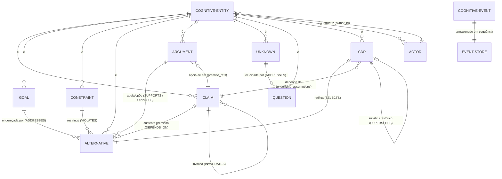

# 04 — Arquitetura de Dados e Grafo Epistêmico (Data Model)

A persistência do Aletheia combina uma estrutura de **Grafo Dirigido e Tipado** (para consulta, traversal e cálculo de saliência) com um **Log Imutável Append-Only orientado a Event Sourcing** (como fonte primária e auditável da verdade).

---

## 1. Diagrama Entidade-Relacionamento Conceitual

O modelo de entidades e suas conexões canônicas está ilustrado no diagrama Mermaid abaixo:



---

## 2. As 14 Relações Semânticas do Grafo (`EdgeRelation`)

As arestas do Grafo Epistêmico são modeladas pela classe `Edge` em [`aletheia/ports/graph_port.py`](file:///home/Aelton0/Dev/Projeto%20AGI/Aletheia/aletheia/ports/graph_port.py#L10-L15) e categorizadas em [`aletheia/core/events/schemas.py`](file:///home/Aelton0/Dev/Projeto%20AGI/Aletheia/aletheia/core/events/schemas.py#L10-L26):

| Relação | Semântica | Origem (`source_id`) | Destino (`target_id`) | Comportamento no TMS |
| :--- | :--- | :--- | :--- | :--- |
| `supports` | Sustentação argumentativa ou epistêmica | `Argument` / `Claim` | `Alternative` / `Recommendation` | Queda da premissa suspende a recomendação apoiada |
| `opposes` | Objeção crítica contra uma alternativa | `Argument` / `Claim` | `Alternative` | Não invalida; adiciona fricção analítica |
| `depends_on` | Dependência lógica estrita de premissa | `Alternative` / `Inference` / `CDR` | `Claim` / `Evidence` | **Queda da premissa suspende a origem em cascata** |
| `derived_from` | Origem lógica de inferência dedutiva/indutiva | `Inference` | `Claim` / `Evidence` | Queda da premissa suspende a inferência |
| `invalidates` | Falsificação formal empírica | `Evidence` / `Claim` | `Claim` | Altera status do alvo para `INVALIDATED` |
| `contradicts` | Inconsistência dialética mútua | `Claim` | `Claim` | Registra aresta bidirecional e marca ambos com `CONFLICT` |
| `supersedes` | Substituição histórica formal | `CDR` | `CDR` anterior | Permite rastreamento da evolução do pensamento |
| `addresses` | Proposta de resolução de meta ou dúvida | `Alternative` / `Question` | `Goal` / `Unknown` | Ancoragem teleológica e de clarificação |
| `violates` | Colisão detectada com restrição inviolável | `Alternative` | `Constraint` | Sinaliza quebra de regra pelo validador |
| `selects` | Escolha soberana formalizada | `CDR` | `Alternative` | Registra a alternativa ratificada pelo humano |
| `implements` | Execução concreta no mundo real | `Action` | `CDR` | Ancoragem operacional |
| `results_in` | Conexão entre ação e resultado empírico | `Action` | `Outcome` | Rastreabilidade da intervenção |
| `reveals` | Detecção de discrepância cognitiva | `Outcome` | `EpistemicDelta` | Origem do aprendizado |
| `learned_from` | Ancoragem da heurística na experiência | `Lesson` | `EpistemicDelta` | Prova empírica da regra atualizada |

---

## 3. Modelo de Event Sourcing (`CognitiveEvent`)

Qualquer alteração estrutural no Aletheia é imutável e preservada no `EventStorePort` como uma instância da classe `CognitiveEvent` ([`aletheia/core/events/schemas.py`](file:///home/Aelton0/Dev/Projeto%20AGI/Aletheia/aletheia/core/events/schemas.py#L28-L37)):

```python
class CognitiveEvent(BaseModel):
    model_config = ConfigDict(frozen=True, extra="forbid")

    event_id: str = Field(default_factory=lambda: f"evt_{uuid.uuid4().hex[:10]}")
    timestamp: datetime = Field(default_factory=lambda: datetime.now(timezone.utc))
    actor_id: str
    event_type: str
    payload: Dict[str, Any]
```

### 3.1. Catálogo de Eventos Registrados no Código
1. `EntityIntroduced`: Disparado sempre que um novo nó (meta, premissa, alternativa, ator) é adicionado ao grafo.
2. `RelationConnected`: Disparado sempre que dois nós são conectados por uma relação `EdgeRelation`.
3. `PremiseChallenged`: Disparado na intervenção humana de contestação (`challenge_claim`).
4. `PremiseInvalidated`: Disparado na invalidação empírica de um claim (`invalidate_claim`).
5. `ContradictionRegistered`: Disparado quando duas proposições são marcadas como conflitantes.
6. `DecisionRatified`: Disparado na formalização de um `CognitiveDecisionRecord`.
7. `HumanDirectionChanged`: Disparado quando o humano altera o foco da deliberação.
8. `CapabilityExecuted`: Disparado quando o `CapabilityRuntime` executa um step analítico.

### 3.2. Mecanismo de Replay Determinístico
Implementado em `CognitiveWorkspace.replay(events)` ([`aletheia/core/context/workspace.py:L226-282`](file:///home/Aelton0/Dev/Projeto%20AGI/Aletheia/aletheia/core/context/workspace.py#L226-L282)), o replay:
1. Instancia um novo `CognitiveWorkspace` limpo em memória.
2. Itera sequencialmente sobre cada `CognitiveEvent`.
3. Recria entidades a partir do mapa tipado `ENTITY_CLASS_MAP`.
4. Reconstitui as arestas direcionadas com seus metadados.
5. Reaplica contestações e invalidações de TMS deterministamente.
6. O estado final reproduz com 100% de precisão os nós, conexões e status do ciclo original.

---

## 4. Auditoria de Armazenamento e Integridade

### 4.1. Avaliação de Persistência Atual
* **FATO**: Todo o armazenamento opera exclusivamente na memória RAM (`InMemoryGraphAdapter` e `InMemoryEventStore`).
* **PROBLEMA**: Se o processo Python for finalizado (crash, encerramento de terminal, reinício de container), **todos os eventos e todo o grafo são perdidos irrevogavelmente**, a menos que o usuário tenha serializado manualmente os eventos (funcionalidade que ainda não está implementada em disco).
* **PROBLEMA**: O `InMemoryEventStore` mantém uma lista contínua em memória (`List[CognitiveEvent]`). Em sessões com milhares de eventos ou fluxos de longa duração, haverá crescimento não delimitado de consumo de memória RAM (falta de snapshots / compactação).

### 4.2. Avaliação de Integridade Referencial
* O método `InMemoryGraphAdapter.add_edge()` valida se `source_id` e `target_id` existem no grafo, disparando `KeyError` caso algum nó seja inexistente.
* Não há verificação no `add_node()` para impedir a sobrescrita acidental de nós com o mesmo ID (apenas sobrescreve o dicionário `self._nodes[entity.id] = entity`), embora `generate_id` utilize UUIDs aleatórios de 10 caracteres hexadecimais, minimizando colisões.
* A remoção de nós não está implementada no `GraphStoragePort` (*FATO*), o que reforça o princípio de imutabilidade histórica (nós são suspensos ou invalidados, mas não deletados fisicamente).

### 4.3. Avaliação de Concorrência
* As estruturas internas são dicionários (`dict`) e listas (`list`) padrão do Python.
* Não há travas (`threading.Lock` ou `asyncio.Lock`). O sistema é seguro para o uso atual estritamente monothread, mas sofrerá corrupção de dados e condições de corrida imediatas caso múltiplos threads ou tarefas assíncronas concorrentes acessem o mesmo `CognitiveWorkspace`.
