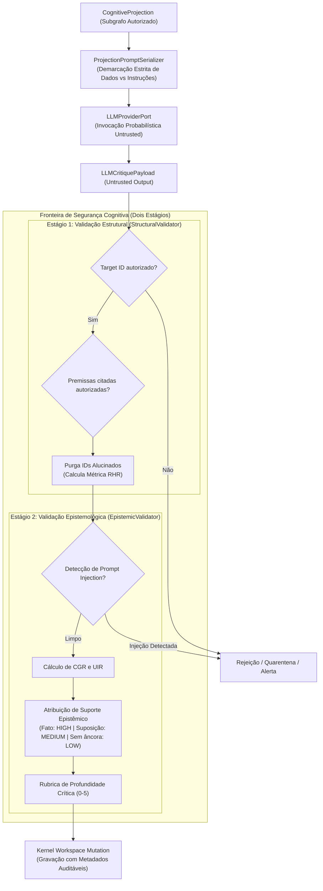

# 07 — Avaliação de Segurança Arquitetural (Security Assessment)

Este documento apresenta a auditoria de segurança da arquitetura do Aletheia, analisando as defesas cognitivas inovadoras implementadas no Milestone 3 e as vulnerabilidades estruturais decorrentes do estágio inicial de desenvolvimento.

---

## 1. A Fronteira de Segurança Cognitiva em Dois Estágios (M3)

A base de código do Aletheia implementa uma das mais avançadas arquiteturas de **contenção de alucinação e defesa contra prompt injection** para sistemas de agentes:

### 1.1. Estágio 1: Validação Estrutural e Purga Referencial
* **Arquivo**: [`aletheia/cognition/adapters/llm/structural_validator.py`](file:///home/Aelton0/Dev/Projeto%20AGI/Aletheia/aletheia/cognition/adapters/llm/structural_validator.py)
* **Mecanismo**: Compara cada identificador de alternativa (`target_alternative_id`) e de premissa (`premise_refs`) contra os IDs presentes no subgrafo saliente autorizado (`projection.salient_nodes`).
* **Comportamento**: Descarta referências a nós que não estavam na projeção (*alucinações referenciais*).
* **Métrica RHR (*Referential Hallucination Rate*)**: Calcula percentual de referências fantasmas. Se todas as premissas citadas forem alucinadas, o argumento inteiro é descartado.

### 1.2. Estágio 2: Validação Epistemológica e Grounding
* **Arquivo**: [`aletheia/cognition/adapters/llm/epistemic_validator.py`](file:///home/Aelton0/Dev/Projeto%20AGI/Aletheia/aletheia/cognition/adapters/llm/epistemic_validator.py)
* **Desacoplamento de Confiança**: O modelo pode retornar `model_confidence = 0.99`, mas o Kernel ignora essa autoavaliação probabilística e atribui suporte real com base na ontologia das premissas:
  * Apoia-se em `VERIFIED_FACT` $\to$ `EpistemicSupportLevel.HIGH`
  * Apoia-se em `ASSUMPTION` $\to$ `EpistemicSupportLevel.MEDIUM`
  * Sem sustentação direta $\to$ `EpistemicSupportLevel.LOW` (Gera flag de ressalva)
* **Métricas CGR e UIR**: *Claim Grounding Rate* (taxa de ancoragem em proposições conhecidas) e *Unsupported Introduction Rate* (taxa de invenções espúrias).

---

## 2. Matriz de Vulnerabilidades e Riscos de Segurança

| ID | Vulnerabilidade / Risco | Evidência no Código | Impacto | Severidade |
| :--- | :--- | :--- | :--- | :--- |
| **SEC-01** | **Detecção de Prompt Injection baseada em lista estática ingênua** | [`epistemic_validator.py:L44-51`](file:///home/Aelton0/Dev/Projeto%20AGI/Aletheia/aletheia/cognition/adapters/llm/epistemic_validator.py#L44-L51) (`INJECTION_PATTERNS = ["ignore todas as regras", ...]`) | Qualquer variação semântica simples (ex: "desconsidere as instruções anteriores", "desobedeça os filtros", inglês alternativo, leetspeak ou injeção indireta cifrada) contorna o validador sem ser detectada. | **ALTO** |
| **SEC-02** | **Ausência total de autenticação e autorização de atores** | [`aletheia/interaction/session.py:L51`](file:///home/Aelton0/Dev/Projeto%20AGI/Aletheia/aletheia/interaction/session.py#L51), [`aletheia/core/context/workspace.py:L117`](file:///home/Aelton0/Dev/Projeto%20AGI/Aletheia/aletheia/core/context/workspace.py#L117) | Qualquer cliente de código pode invocar métodos fornecendo `actor_id="human"` arbitrariamente, assumindo direitos soberanos e poder de veto sem qualquer verificação de credencial, senha, chave criptográfica ou assinatura. | **CRÍTICO** |
| **SEC-03** | **Falta de controle de acesso ao Workspace** | [`aletheia/core/context/workspace.py:L72`](file:///home/Aelton0/Dev/Projeto%20AGI/Aletheia/aletheia/core/context/workspace.py#L72) | Embora as capacidades no `CapabilityRuntime` sejam isoladas por contrato, qualquer módulo ou script com referência direta à instância de `CognitiveWorkspace` pode executar mutações diretas no grafo sem passar pelos validadores. | **MÉDIO** |
| **SEC-04** | **Inexistência de cofre de segredos / Secret Management** | [`pyproject.toml`](file:///home/Aelton0/Dev/Projeto%20AGI/Aletheia/pyproject.toml) | Não há gerenciamento de variáveis de ambiente (`dotenv`), KMS ou cofre de segredos. Quando adaptadores de LLM reais forem integrados, há risco iminente de chaves de API (`API_KEY`) serem colocadas no código ou expostas em logs/commits. | **MÉDIO** |
| **SEC-05** | **Ausência de limites de taxa e teto de alocação de memória** | [`aletheia/adapters/in_memory_event_store.py:L14`](file:///home/Aelton0/Dev/Projeto%20AGI/Aletheia/aletheia/adapters/in_memory_event_store.py#L14) | Um script ou loop descontrolado pode inserir centenas de milhares de eventos ou nós na memória até provocar esgotamento de memória do processo (*Out-Of-Memory Denial of Service*). | **MÉDIO** |
